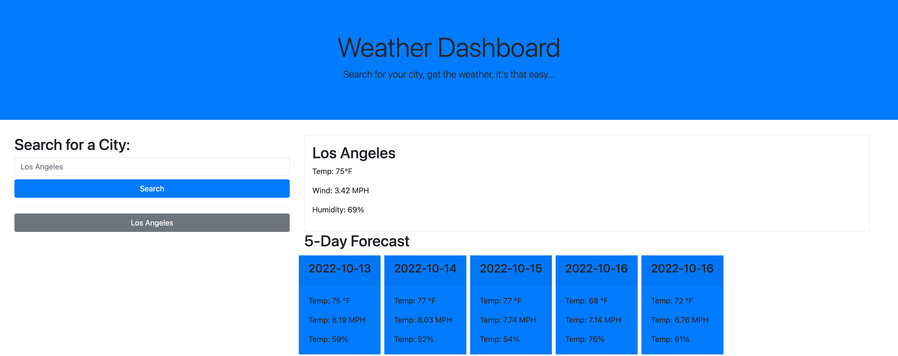

# Challenge 06 - Weather App

## Description

This app allows you to search for current weather conditions for any city including the temperature, wind speed, and humidity. It also displays the upcoming 5 day forecast. This weather app uses the OpenWeather API to obtain geocoding data (to get the coordinates of the entered city) and to obtain current and 5 day forecasts.

## Table of Contents

-[Usage](#usage)
-[Screenshot](#screenshot)
-[Credits](#credits)

## Usage

To use this app, simply type in the city you're interested in and click on the search button. You will then be shown the current and 5 day weather conditions for that city. To search for a previously searched city, simply click on the respective city name, shown as a grey button under the blue search button.

[Click Here to Access the Weather App](https://naveed-mahmoudian.github.io/ch-06/)

## Screenshot

See screenshot below:

## Credits

This Weather App was created by Naveed Mahmoudian
